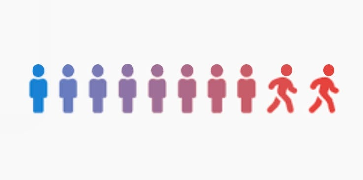
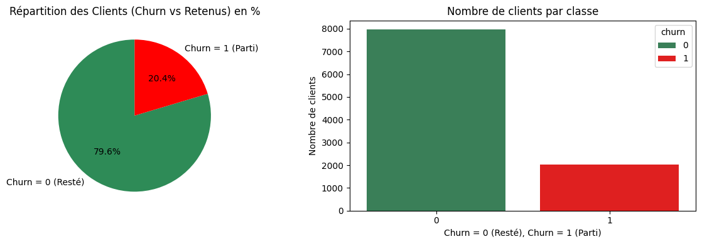
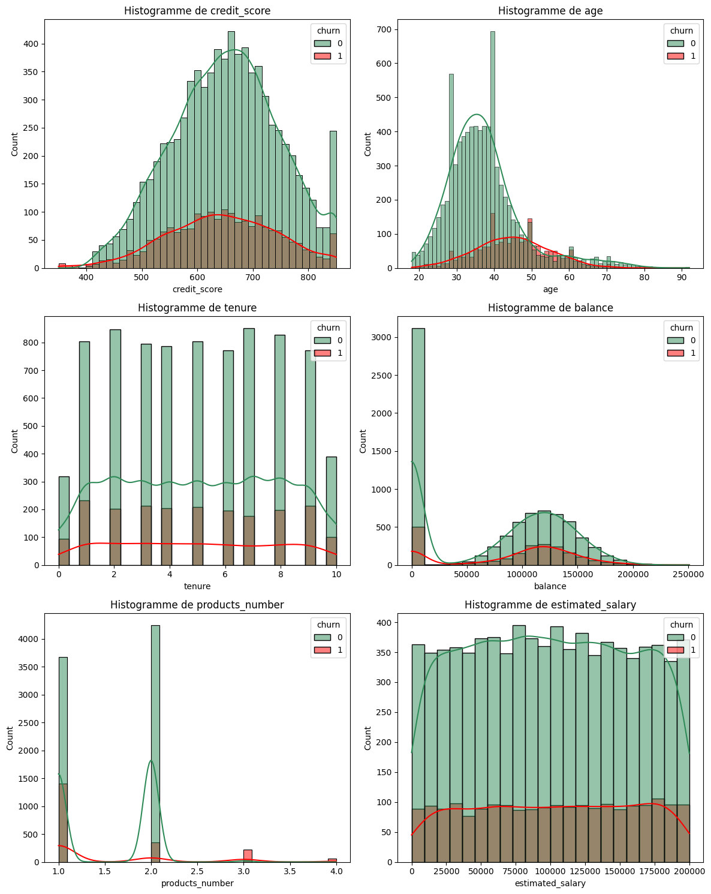
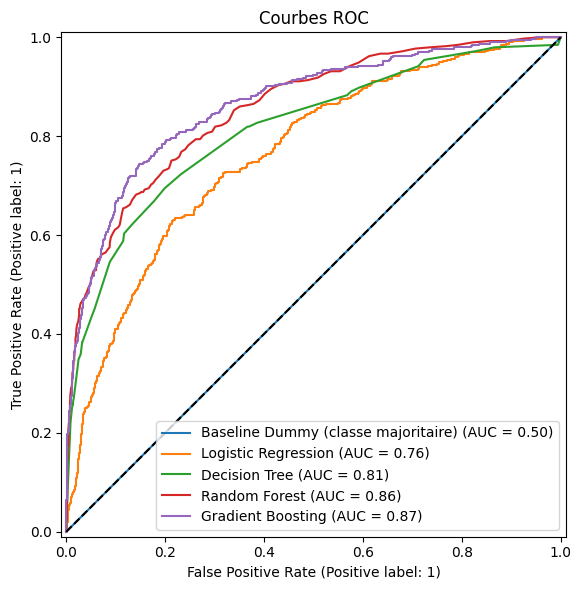

# <div align="center">Bank Customer Churn Prediction</div>

<div align="center">


<p align="center">
  
</p>


> Modèle de Machine Learning pour anticiper le départ des clients bancaires,  
> déployé en production via une API FastAPI et un dashboard Streamlit interactif.
</div>

## Sommaire

### Production
- [Démo en ligne](#démo-en-ligne)

### Approche Data & Insights
1. [Problématique](#1---problématique)
2. [Analyse Exploratoire des Données (EDA)](#2---analyse-exploratoire-des-données-eda)
3. [Modélisation](#3---modélisation)
4. [Explicabilité SHAP](#4---explicabilité-shap)
5. [Insights métier](#5---insights-métier)

### Stack & Industrialisation
6. [Stack technique](#6---stack-technique)
7. [Structure du projet](#7---structure-du-projet)
8. [Installation & Utilisation (API FastAPI)](#8---installation--utilisation-api-fastapi)
9. [License](#-license)


---


## Démo en ligne

| Service | URL |
|---|---|
| **API FastAPI** | [bank-customer-churn-prediction-ic06.onrender.com](https://bank-customer-churn-prediction-ic06.onrender.com) |
| **Dashboard Streamlit** | [bank-churn-dashboard-pzop.onrender.com](https://bank-churn-dashboard-pzop.onrender.com/) |

> Déployé en continu via GitHub Actions → Render. 
> Voir la branche [`production`](../../tree/production) pour l'état déployé.


---


## 1 - Problématique

Dans un secteur bancaire compétitif, acquérir un nouveau client coûte **cinq à sept fois plus cher que d'en fidéliser un existant**. Face à cet enjeu, ce projet transforme la stratégie de rétention : **de réactive à proactive**, en prédisant le taux d'attrition **(churn)** avant qu'il ne se produise.

**Question centrale :** Quels sont les facteurs déterminants qui poussent un client à quitter l'établissement, et peut-on prédire ce comportement avec précision ?


<p align="center">
  
</p>

Le dataset présente un déséquilibre de classe **(~20.4% de churn)**, ce qui nécessite des métriques d'évaluation adaptées **(ROC-AUC, F1-Score)** lors de la modélisation.


---


## 2 - Analyse Exploratoire des Données (EDA)

Avant la modélisation, une analyse fine des distributions a permis de mettre en évidence les comportements distinctifs entre les clients fidèles (`churn=0`) et ceux ayant quitté la banque (`churn=1`).

<p align="center">
  
</p>


---


## 3 - Modélisation

### Approche comparative

Cinq modèles évalués sur quatre métriques (Accuracy, F1-Score, ROC-AUC, CV-AUC) et les résultats importants sont :

<p align="center">
  
</p>

| Modèle | ROC-AUC | CV-AUC |
|---|---|---|
| Dummy Classifier (baseline) | ~0.50 | ~0.50 |
| Logistic Regression | ~0.76 | ~0.76 |
| Decision Tree | ~0.73 | ~0.72 |
| Random Forest | ~0.85 | ~0.85 |
| **Gradient Boosting ✅** | **~0.87** | **~0.86** |


### Feature engineering

Une classe `FeatureEngineering` custom (`BaseEstimator` + `TransformerMixin`) garantit l'absence de fuite de données :

| Feature créée | Description |
|---|---|
| `balance_salary_ratio` | Ratio solde / salaire — proxy du comportement financier |
| `balance_a_zero` | Flag binaire — solde nul (pattern client atypique) |
| Encodage ordinal | `gender`, `country` avec gestion des valeurs inconnues |

### Optimisation des hyperparamètres

`RandomizedSearchCV` — 15 itérations, CV = 5 plis, métrique : ROC-AUC

```python
param_distributions = {
    'model__learning_rate': [0.01, 0.05, 0.1],
    'model__n_estimators':  [100, 150, 200, 250],
    'model__max_depth':     [3, 4, 5],
    'model__subsample':     [0.8, 1.0],
    'model__max_features':  ['sqrt', 'log2'],
}
```


---


## 4 - Explicabilité SHAP

### Explicabilité globale (notebook)

Analyse du comportement du modèle sur l'ensemble du jeu de test :
- `shap.summary_plot` (bar + beeswarm) — classement des variables par importance
- `shap.dependence_plot` — impact de `age`, `products_number`, `active_member`

### Explicabilité locale / individuelle (dashboard)

Explication pour **un client spécifique**, répondant à la question :

> *"Pourquoi M. Villani, 52 ans, résidant en Allemagne, obtient-il un score de churn de 85% ?"*

- **Waterfall plot** : contribution de chaque variable au score final
- **Tableau de contributions** : valeurs réelles du client + impact SHAP coloré  
  (🔴 pousse vers le churn / 🟢 pousse vers la fidélité)


---


## 5 - Insights métier

| Observation | Impact |
|---|---|
| **Âge** — les clients churners ont une médiane d'âge ~45 ans vs ~37 ans pour les clients fidèles | Prédicteur top 2 |
| **Nombre de produits > 2** — associé à un taux de churn bien supérieur | Signal d'alerte fort |
| **Membres inactifs** — taux de churn ~27% vs ~14% pour les membres actifs | Levier d'action direct |
| **Allemagne** — taux de churn ~32%, soit 2× la France et l'Espagne | Segment géographique prioritaire |
| **Score de crédit & salaire estimé** — corrélation quasi nulle avec le churn | Variables non discriminantes |


---


## 6 - Stack technique

| Catégorie | Technologies |
|---|---|
| **Langage** | Python 3.12 |
| **Data & ML** | Pandas 3.0, NumPy 2.4, Scikit-Learn 1.9 |
| **Modèle** | GradientBoostingClassifier (optimisé RandomizedSearchCV) |
| **Explicabilité** | SHAP (TreeExplainer — global & local) |
| **Visualisation** | Matplotlib, Seaborn |
| **API REST** | FastAPI, Pydantic, Uvicorn |
| **Dashboard** | Streamlit |
| **Sérialisation** | Joblib |
| **Notebook** | Jupyter |

---

## 7 - Structure du projet

```plaintext
BANK-CUSTOMER-CHURN-PREDICTION/
│
├── .github/
│   └── workflows/
│       └── deploy.yml                       # Pipeline CI/CD
│
├── data/
│   └── README.md                            # Informations détaillées sur les données
│
├── images/
│   ├── .gitkeep
│   ├── Churn.jpg                            # Image d'illustration principale
│   ├── comparaison.png                      # Graphique des courbes ROC
│   ├── histo.png                            # Multi-histogrammes des distributions
│   └── repar_client.png                     # Graphique de répartition du Churn
│
├── modele/
│   ├── .gitkeep
│   └── bank_churn_model.joblib              # Le modèle sérialisé final
│
├── notebook/
│   ├── .gitkeep
│   └── Bank_Customer_Churn.ipynb            # Notebook de recherche, EDA, modélisation & sérialisation
│
├── source/
│   ├── __pycache__/                         
│   ├── dashboard.py                         # Application interactive Streamlit
│   ├── feature_engineering.py               # Pipeline custom de transformation des données
│   └── main.py                              # API REST développée avec FastAPI
│
├── tests/
│   ├── __init__.py
│   └── test_api.py                          # 7 tests pytest sur les endpoints
│
├── .gitignore                              
├── LICENSE                                 
├── README.md                                
└── requirements.txt                         # Liste des dépendances Python  
```


---

## 8 - Installation & Utilisation (API FastAPI)

**1. Cloner le dépôt et installer les dépendances**

```bash
git clone https://github.com/keinlarry/Bank-Customer-Churn-Prediction.git
cd /Bank-Customer-Churn-Prediction
pip install -r requirements.txt
```

**2. Générer le modèle** (exécuter le notebook complet, ou la section 10.1)

```bash
# Le fichier bank_churn_model.joblib sera créé dans le répertoire courant
jupyter notebook notebook/Bank_Customer_Churn.ipynb
```

**3. Lancer l'API FastAPI**

```bash
uvicorn source.main:app --reload --port 8000
# Documentation interactive : http://localhost:8000/docs
```

**4. Lancer le dashboard Streamlit**

```bash
streamlit run source/dashboard.py
# Interface : http://localhost:8501
```


---

## 📄 License

Ce projet est sous **MIT License**.